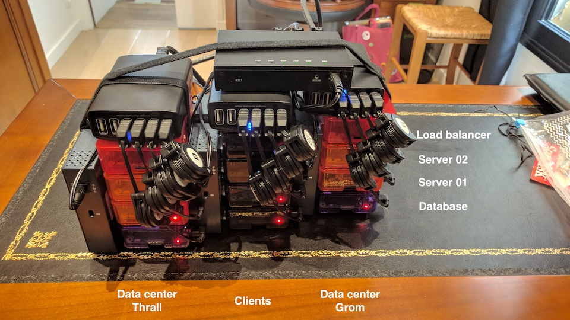
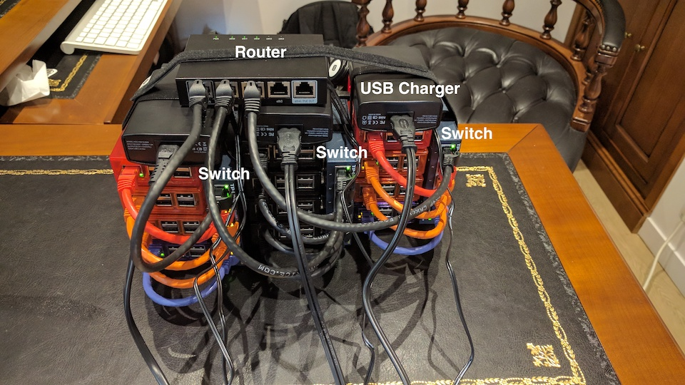

# Setup

This document tells you how to setup the Raspberry PI Cluster which simulates 2 data centers and clients accessing 
those two data centers thanks to the router.

# Prerequisites

## Hardware

The cluster for this demo uses: 

* 12 x [Raspberry PIs V3](https://www.raspberrypi.org/products/raspberry-pi-3-model-b/). Each datacenter is made of 4
 Raspberry PIs, as well as 4 Raspberry PIs for the clients 
* 12 x [Raspberry PI protective case](https://www.amazon.com/Raspberry-Clear-Protective-Heatsinks-Screwdriver/dp/B071YM8QVK/ref=sr_1_25) in different colours, it's better 
* 12 x SD cards (8 Mb is enough)
* 3  x [5-Port Desktop Switch TL-SG105](http://www.tp-link.com/us/products/details/cat-42_TL-SG105.html) to create a 
network between the 2 data centers and the clients.
* 12 x [6 inch ethernet cables](https://www.amazon.com/iMBAPrice-Ethernet-Network-Patch-Cable/dp/B00A1UPGY4/ref=sr_1_1) to plug each Raspberry PI to the switch 
(different colours is better)
* 1  x [Edge Router](https://www.ubnt.com/edgemax/edgerouter-x/) to route clients between the 2 data centers
* 3  x [one foot ethernet cables](https://www.amazon.com/Cable-Matters-5-Pack-Snagless-Ethernet/dp/B00C4U030G/ref=sr_1_1) to plug each switch to the router  
* 3  x [Zookki 6 Port USB Charger](http://www.zookki.com/category/Zookki-USB-Charger) to electrically power the 
Raspberry PIs
* 12 x [Retractable USB to Micro cable](https://www.amazon.com/Vktech-Micro-Retractable-Charger-Cable/dp/B00DQMHM14/ref=sr_1_13) from the charger to the Raspberry PI
* 2  x [Power strip with 6 sockets](http://www.belkin.com/us/F5C048-2-Belkin/p/P-F5C048-2/)
* [Reusable fastening cable tie](https://www.amazon.com/Reusable-Fastening-Cable-Straps-Wisdompro/dp/B01M1L1YHO/ref=pd_rhf_se_p_img_2) because you want to tie 
everything so it doesn't look like a mess
* 1 x [USB to SD Card Reader](https://www.amazon.com/Cateck-USB3-0-4-Slot-Reader-Micro/dp/B01J5651NA) to flash the SD
 cards

## Software

To setup the Raspberry PI Cluster you need the following tools to be installed:

* [Docker](https://www.docker.com/)
* [Ansible](https://www.ansible.com/) ([how to install it](https://valdhaus.co/writings/ansible-mac-osx/)
* The Hypriot [flash utility](https://github.com/hypriot/flash)
* (optional) [Pipe Viewer](http://brewformulas.org/Pv) to monitor the progress of data (handy when flashing SD cards)

# Setup the Physical Raspberry PI Cluster 

For this demo, the cluster is setup as follow:

* 3 Raspberry PIs acting as clients browsing the 2 data centers (`pi-client-01`, `pi-client-02` and `pi-client-03`) 
* 1 Load balancer for the clients (`pi-load-balancer`)
* Data center [Thrall](https://en.wikipedia.org/wiki/Characters_of_Warcraft#Thrall) 
  * 1 load balancer (`pi-thrall-load-balancer`) 
  * 2 servers (`pi-thrall-server-01` and `pi-thrall-server-02`) 
  * 1 database (`pi-thrall-database`) 
* Data center [Grom](https://en.wikipedia.org/wiki/Characters_of_Warcraft#Grommash_Hellscream) 
  * 1 load balancer (`pi-grom-load-balancer`) 
  * 2 servers (`pi-grom-server-01` and `pi-grom-server-02`) 
  * 1 database (`pi-grom-database`) 

## Setup the Raspberry PIs

You need to install [HypriotOS](http://blog.hypriot.com/about/#hypriotos) on each SD card (that's 12 of them). 
HypriotOS is a minimal Debian-based operating systems that is optimized to run Docker on Raspberry PIs. For that, you
 need to flash Hypriot using the [flash utility]()https://github.com/hypriot/flash).

Insert the SD card, and use the following commands to flash each cards (notice that `--hostname` sets the hostname for 
the SD image):
- `flash --hostname pi-client-01 https://github.com/hypriot/image-builder-rpi/releases/download/v1.5
.0/hypriotos-rpi-v1.5.0.img.zip` # downloads and then flashes the card 
- `flash --hostname pi-client-02 hypriotos-rpi-v1.5.0.img` # doesn't need to download the image anymore, just flashes
- `flash --hostname pi-client-03 hypriotos-rpi-v1.5.0.img`
- `flash --hostname pi-load-balancer hypriotos-rpi-v1.5.0.img`
- `flash --hostname pi-grom-load-balancer hypriotos-rpi-v1.5.0.img`
- `flash --hostname pi-grom-server-01 hypriotos-rpi-v1.5.0.img`
- `flash --hostname pi-grom-server-02 hypriotos-rpi-v1.5.0.img`
- `flash --hostname pi-grom-database hypriotos-rpi-v1.5.0.img`
- `flash --hostname pi-thrall-load-balancer hypriotos-rpi-v1.5.0.img`
- `flash --hostname pi-thrall-server-01 hypriotos-rpi-v1.5.0.img`
- `flash --hostname pi-thrall-server-02 hypriotos-rpi-v1.5.0.img`
- `flash --hostname pi-thrall-database hypriotos-rpi-v1.5.0.img`

## Setup the Router

For this sample, we use the [Ubiquiti EdgeRouter X](https://www.ubnt.com/edgemax/edgerouter-x/). 
It's a cheap router with a lot of features in it. Any other router should work just fine, but the instructions detailed 
here are for the EdgeRouter X.

### Reset to Factory Settings
* Power on the Ubiquiti Router, place a paper clip or Pin into the hole on the back of the Router labeled Reset.
* Hold paper clip or pin down for 10 to 15 seconds and release.
* The Router will reboot on its own. Once the WLAN light stops blinking, the Router is reset.

### Connect to the Router
* Plug your computer into `eth0` on the router.
* Configure your computer to have the static IP (eg. `192.168.1.3`). The Router IP is `192.168.1.1`.


* Open a browser and navigate to `https://192.168.1.1`. You should get the login screen to access the Router console. 
(You may need to trust the certificate first).

* Login with Username `ubnt` and Password `ubnt`.

### Setup DHCP Server
* The Router DHCP Server will provide your PI's with Internet Connection, by sharing a home Internet Connection.
* Go to Wizards / WAN + 2LAN2 to set up DHCP Server. Use a non conventional range like `10.99.99.1` to avoid clashing with 
other networks. The DHCP will assign IP's from `10.99.99.1` to `10.99.99.255`.


* Click `Apply` (then `Apply Changes` and `Reboot`). The Router should restart with the new settings.
* Unplug your computer from the Router `eth0` and plug it on another port (eg. `eth4`) 
* Connect your Home Internet on `eth0`.
* Remove the static IP from your computer configuration. The router should now assign you a Dynamic IP in the 
`10.99.99.x` range (eg. `10.99.99.x`). On Mac OS X you can force it by renewing the DHCP lease
* The Router is now available in `https://10.99.99.1`. You require to change the browser address and relog to the Router
console.
* At this moment in time, if the Raspberry PIs are switched on, after a few minutes, you should get dynamic IPs for all of them.


### (optional) Map Static IP's instead of dynamic if you prefer
* If you wish, you can assign static IP's to your PI's (not required, but usefull if you want to make sure that you 
access the same PI with the same IP everytime).
* Go to Services / LAN / Actions / View Details / Static MAC/IP Mapping.
* If it does not exist, create a new mapping with your IP address (10.99.99.x) and Mac address (on OSX you get your Mac address from Network preferences)


* In the Config Action for each Host you can set up the IP for the Host.

### Hostname into Hosts files
* The Router has a hosts files to resolve DNS names.
* To be able to resolve Hostnames from boxes connecting to the Router, we need to activate a configuration. 
* Go to Config Tree / service / dhcp-server / hostfile-update, set to "enable", click on preview and apply. (This will register the PI's 
hostnames in the hosts files and they will be reachable via DNS)


* Now you should ping the hostnames (and not just the physical IP addresses) `ping pi-thrall-server-01`, `ping ppi-client-01`... If this doesn't work
try to reboot the router (to make sure the hostfile-update set to "enable" has been taken into account)

### Adding Manual entries to Hosts file
* This operation can only be done in the CLI console.
* Useful to register multiple hostnames to the same IP. For instance a `docker-repo` host running in your computer to 
provision the docker images to run in the PI's. Set manual hostname for local docker registry and elk (own box - using 10.99.99.11)).

```
ssh ubnt@10.99.99.1
Welcome to EdgeOS

By logging in, accessing, or using the Ubiquiti product, you
acknowledge that you have read and understood the Ubiquiti
License Agreement (available in the Web UI at, by default,
http://192.168.1.1) and agree to be bound by its terms.

ubnt@10.99.99.1's password:
Linux ubnt 3.10.14-UBNT #1 SMP Mon Nov 2 16:45:25 PST 2015 mips
Welcome to EdgeOS
Last login: Sun Sep  3 21:09:22 2017 from radcortez
ubnt@ubnt:~$ configure
[edit]
ubnt@ubnt# set system static-host-mapping host-name docker-repo inet 10.99.99.11
[edit]
ubnt@ubnt# commit
[edit]
ubnt@ubnt# save
Saving configuration to '/config/config.boot'...
Done
e[edit]
ubnt@ubnt# exit
exit
ubnt@ubnt:~$ exit
logout
Connection to 10.99.99.1 closed.
```

And do the same for each Rasperry PI, for example : 

```
ubnt@ubnt# set system static-host-mapping host-name pi-thrall-load-balancer inet 10.99.99.69
ubnt@ubnt# set system static-host-mapping host-name pi-thrall-server-01 inet 10.99.99.61
ubnt@ubnt# set system static-host-mapping host-name pi-thrall-server-02 inet 10.99.99.62
ubnt@ubnt# set system static-host-mapping host-name pi-thrall-database inet 10.99.99.60
 
ubnt@ubnt# set system static-host-mapping host-name pi-load-balancer inet 10.99.99.79
ubnt@ubnt# set system static-host-mapping host-name pi-client-01 inet 10.99.99.71 
ubnt@ubnt# set system static-host-mapping host-name pi-client-02 inet 10.99.99.72
ubnt@ubnt# set system static-host-mapping host-name pi-client-03 inet 10.99.99.73

ubnt@ubnt# set system static-host-mapping host-name pi-grom-load-balancer inet 10.99.99.89
ubnt@ubnt# set system static-host-mapping host-name pi-grom-server-01 inet 10.99.99.81
ubnt@ubnt# set system static-host-mapping host-name pi-grom-server-02 inet 10.99.99.82
ubnt@ubnt# set system static-host-mapping host-name pi-grom-database inet 10.99.99.80

ubnt@ubnt# commit
ubnt@ubnt# save
ubnt@ubnt# exit
```

You should end up with the following configuration (Config Tree / system / static-host-mapping / host-name ) 


# Setup the application on the cluster 

## Setup Docker Repo Registry

To avoid using the [Docker Hub](https://hub.docker.com/) to pull/push Docker images, we setup a local Docker 
repository (on the Mac). A registry stores and lets you distribute Docker images. This explains how to setup a 
[local Docker Registry](https://docs.docker .com/registry/deploying/). We will call it `docker-repo`.

First, generate the certificates:
- `openssl req -newkey rsa:4096 -nodes -sha256 -keyout docker-repo.key -x509 -days 365 -out docker-repo.crt`
- This creates two files (`docker-repo.crt` and `docker-repo.key`) that are installed under the directory 
`ansible/docker-repo/certs` (used by the `REGISTRY_HTTP_TLS_CERTIFICATE` variable)

Run the local Docker Registry:
- docker run -d -p 5000:5000 --restart=always --name docker-repo -v `pwd`/certs:/certs -e REGISTRY_HTTP_TLS_CERTIFICATE=/certs/docker-repo.crt -e REGISTRY_HTTP_TLS_KEY=/certs/docker-repo.key registry:2

- The self signed certificates need to be added to the PI's so Docker can downloads images from the local Docker 
Registry. They also need to be added to the local Docker Registry host. For Macs, the easiest way is to add the address 
(docker-repo:5000), in the Mac Docker Daemon / Preferences / Daemon / Insecure Registries.

## Setup PI's
Run the following Ansible playbooks in order:
- ansible-playbook docker-repo/install-repo-certs.yaml -i hosts -f 12
- reboot PI's (docker needs a restart to use the certificate)
- ansible-playbook load-balancers/load-balancers.yaml -i hosts -f 3
- ansible-playbook install-tomee.yaml -i hosts -f 8
- ansible-playbook databases/install-mysql.yaml -i hosts -f 2

## Add Applications (Client and Server)
- Build client and server with ```mvn clean install docker:build -DpushImage``` (this should build and upload the docker
images to the local registry)
- ansible-playbook servers/servers.yaml -i hosts -f 4
- ansible-playbook clients/clients.yaml -i hosts -f 3

## Useful links:
- https://docker-repo:5000/v2/_catalog (Local Docker Registry Catalog)
- http://pi-load-balancer:5000/stats (HA Proxy Stats)
- http://pi-grom-load-balancer:5000/stats (HA Proxy Stats)
- http://pi-thrall-load-balancer:5000/stats (HA Proxy Stats)

## Setup Metrics
- To run Metrics, use Docker Compose to start an ElasticSearch, Logstash, Kibana environment.
- Execute ```docker-compose up -d elk```. Then you can just stop / start the container with ```docker stop elk``` and ```docker start elk``` 
- Add the template.json into ElasticSearch: ```curl http://pi-elastic-01:9200/_template/tribe_template -d @template.json```
- Add the initial Kibana index pattern. Go to Kibana / Settings / Indices / Index name or pattern = tribe-metrics-* and Time-field name = @timestamp
- Import the dashboards. Use the file ```visualizations.json``` and go to Kibana / Settings / Objects / Import

# What it looks like

## Front of the cluster



## Back of the cluster



